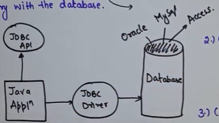

# INTRODUCTION

Java Database Connectivity  
Java API used to connect and interact with databases.



Steps to connect to database in JAVA

```java
package myPackage;

import java.sql.Connection;
import java.sql.DriverManager;
import java.sql.Statement;

public class Main {
    public void createDatabase(){
        try{
            // 1. loading driver (optional after jdbc4+)

            // 2. connection establishement
            String url = "jdbc:mysql://localhost:3306/"; //database
            String userName = "root";
            String password = "Mysql@1603";
            Connection conn = DriverManager.getConnection(url, userName, password);

            // 3. creating statement
            Statement stm = conn.createStatement();

            // 4. create query
            String query = "create database AyushPoddar";
            stm.execute(query);
            System.out.println("Database created successfully");

            //5. closing the connection
            conn.close();
        }
        catch(Exception e){
            e.printStackTrace();
        }
    }
}
```

## JDBC Statement vs PreparedStatement
| Feature  | Statement                     | PreparedStatement                      |
| -------- | ----------------------------- | -------------------------------------- |
| Defined In | `java.sql.Statement`        | `java.sql.PreparedStatement`                   |
| Purpose    | Executes simple SQL queries | Executes **precompiled** parameterized queries |
| Query Type | Static queries              | Dynamic queries with placeholders (`?`)        |
| Speed    | Slower for repetitive queries | Faster due to precompilation           |
| Syntax   | `"SELECT * FROM users"`       | `"SELECT * FROM users WHERE name = ?"` |
| **Security**           | Prone to **SQL injection**               | Safe from SQL injection (uses binding)             |
| **Performance**        | Compiled each time                       | Compiled once and reused → **faster**              |
| **Reusability**        | New query every time                     | Can reuse the same query with different values     |
| **Code Readability**   | Harder to read/maintain with many inputs | Cleaner, especially with long or repeated queries  |
