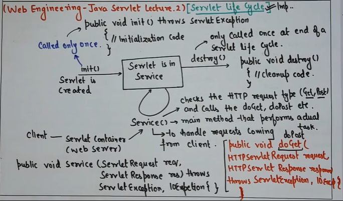

**What is a Servlet?**  
Programs that run on a web server (e.g., Tomcat).  
A Java class that handles HTTP requests and responses.  
Used to create dynamic web content.

---
### LIFECYCLE
Loading and Instantiation – Container loads the servlet class

1. Initialization (init()) – Called once when servlet is first loaded.
2. Request Handling (service()) – Called each time a request is made.
3. Destruction (destroy()) – Called once before servlet is removed.

---
### ARCHITECTURE
