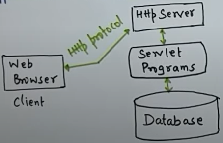

## **What is a Servlet?**  
- A Java class that handles HTTP requests and responses.  
- Runs on a web server (Tomcat) 
- Used to create dynamic web content.
- 

---
### LIFECYCLE


1. Initialization (`init()`)  
   - Called once when servlet is first loaded.
        ```java
        public void init() throws ServletException{
            ....
        } 
        ```
2. Request Handling (`service()`)
   - Called each time a request is made.
   - Checks Http request type get/post and call doGet/doPost
   - Perform Actual tasks
3. Destruction (`destroy()`)   
Called once before servlet is removed.


---
### ARCHITECTURE


## SECURITY ISSUES

| **Issue**                             | **Description**                                                    | **Mitigation**                                                           |
| ------------------------------------- | ------------------------------------------------------------------ | ------------------------------------------------------------------------ |
| **URL Manipulation**                  | Attackers modify query parameters to access unauthorized resources | Validate inputs; restrict direct access; avoid sensitive data in URLs    |
| **Session Hijacking**                 | Stealing session ID to impersonate another user                    | Use HTTPS, regenerate session IDs, use secure cookies, timeout sessions  |
| **Cross-Site Scripting (XSS)**        | Malicious scripts injected into web pages                          | Encode output, sanitize input, use security libraries                    |
| **CSRF (Cross-Site Request Forgery)** | Unintended actions triggered via forged requests                   | Use CSRF tokens, validate referer/origin headers                         |
| **SQL Injection**                     | Injecting malicious SQL via input fields or parameters             | Use `PreparedStatement`, validate inputs, never concatenate SQL strings  |
| **Improper Access Control**           | Users accessing unauthorized content via URLs                      | Server-side checks, session-based auth, use filters or annotations       |
| **Information Leakage**               | Revealing error messages, stack traces, server details             | Hide error details, use custom error pages, avoid logging sensitive info |
| **Insecure Data Transmission**        | Sensitive data exposed via plain HTTP                              | Use HTTPS/SSL; avoid transmitting passwords in plain text                |
| **Directory Traversal**               | Accessing restricted files via `../` paths                         | Sanitize file paths, avoid direct file access from user input            |
| **Insecure Deserialization**          | Running code via manipulated serialized data                       | Avoid deserialization of untrusted data; use safe serialization formats  |
